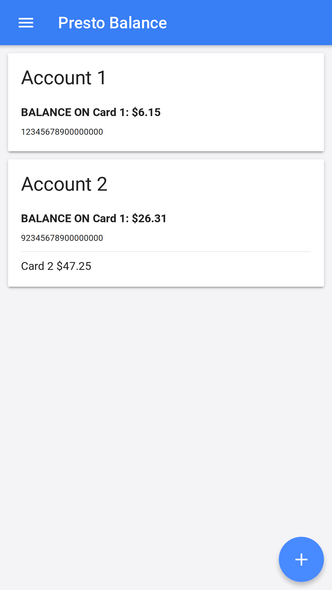

 

PrestoApp
===

## Home Page

## Details Page

## Edit Account

## Setup

### Install 
 * nodejs
 * Android/iOS SDK (for building app)
 * Ionic (`npm install -g ionic`)
 * Cordova (`npm install -g cordova`)
 
### Build
* `ionic cordova platform add {android|ios}`
* `ionic cordova build {android|ios}`
